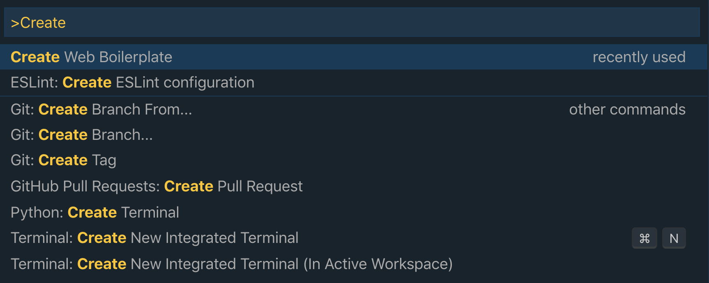

# Web Boilerplate README

This extension allows you to generate index.html, app.css, and app.js files for a starter web application. The html links to the css and js files appropriately, so you are ready to start developing!

## How to Use
This extension is incredibly simple to use. You'll just need to run the `Create Web Boilerplate` command in the Command Palette.

To open the Command Palette, you can use `Command+Shift+P` on Mac or `Control+Shift+P` on Windows.  Then type 'Create Web Boilerplate'.

***Note*** - You will need to have a directory/project already open in VS Code for this to work.

You'll then see your three files created in the File Explorer tab.

## Features

Quickly create necessary files for a starter web application.

## Requirements

No requirements or dependencies

## Release Notes

### 1.0.3

Added instrucions on how to use

### 1.0.3
Initial release
