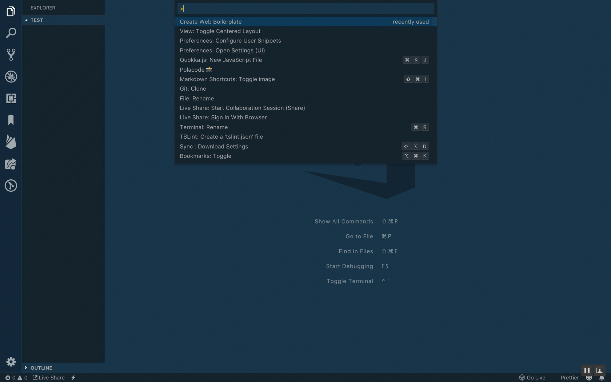

# Web Boilerplate README

This extension allows you to generate index.html, app.css, and app.js files for a starter web application. The html links to the css and js files appropriately, so you are ready to start developing!

## Features

Quickly create necessary files for a starter web application.

## Requirements

No requirements or dependencies

## Extension Settings

No extension settings

## Release Notes

### 1.0.0

Initial release
